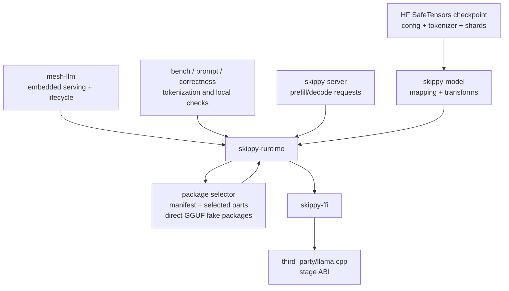

# skippy-runtime

Safe Rust wrapper around the experimental skippy C ABI.

This crate owns Rust-side model/session wrappers and converts raw ABI buffers
into typed runtime structures.

## Architecture Role

`skippy-runtime` is the safe model/session layer used by mesh, servers,
diagnostic prompt clients, benchmarks, correctness checks, and slicing tools.
It does not own TCP transport, mesh lifecycle, or telemetry export.

For inference, the runtime opens a stage view, creates a session, runs prefill
or decode for that stage's layer range, and returns either an activation frame
for downstream stages or a predicted token on the final stage. KV page
state export/import also passes through this crate for runtimes that expose
native exact-cache movement.

## Responsibilities

- open staged model views
- open local Hugging Face SafeTensors checkpoints directly, with optional
  tensor-by-tensor load-time quantization and no intermediate GGUF
- create runtime sessions
- tokenize and detokenize through llama
- run prefill/decode calls
- set llama.cpp context options needed by staged serving, including K/V cache
  type selection for upstream-supported cache types and selected backend device
  placement
- expose activation frames with descriptors and payloads
- select layer-package parts from local or Hugging Face package refs
- validate package ABI/manifest compatibility before loading or composing parts
- expose declared `mmproj` projector artifacts from package manifests for
  multimodal serving
- compose materialized package stages for tools that need a concrete GGUF path
- open selected package parts directly through the ABI for server runtime loads

Keep service lifecycle, transport, and telemetry in higher-level crates.

## Direct SafeTensors loading

`StageModel::open` recognizes a local checkpoint directory containing
`config.json` plus either `model.safetensors` or
`model.safetensors.index.json`. It also accepts a `.safetensors` file and uses
its parent directory for the checkpoint metadata. Set
`RuntimeConfig::checkpoint_quantization` to preserve the canonical checkpoint
types or select a supported llama.cpp quantization recipe such as `Bf16`,
`Q4KM`, `IQ2XXS`, or `Q8_0`. Importance-aware recipes use
`RuntimeConfig::checkpoint_imatrix`; relative paths resolve from the checkpoint
directory, and required tensor entries are validated before model allocation.
The shipped runtime exposes the same settings as
`mesh-llm serve --quant <RECIPE>` and `--checkpoint-imatrix <PATH>`; explicit
CLI values take precedence over both default and model-local configuration.

The runtime validates immutable shards with the official Rust `safetensors`
crate. `skippy-model` maps and transforms source tensors, while the native
Skippy ABI chooses destination tensor types and quantizes each stage-owned
tensor as it is loaded. This initial direct path does not materialize a derived
artifact cache and does not emit the GGUF model-open progress events.
